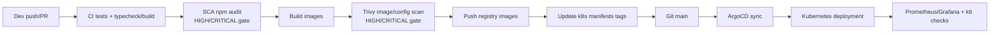

# CI/CD Diagram (GitHub + GitLab + ArgoCD)

```mermaid
flowchart LR
  A[Dev push/PR] --> B[CI tests + typecheck/build]
  B --> C[SCA npm audit<br/>HIGH/CRITICAL gate]
  C --> D[Build images]
  D --> E[Trivy image/config scan<br/>HIGH/CRITICAL gate]
  E --> F[Push registry images]
  F --> G[Update k8s manifests tags]
  G --> H[Git main]
  H --> I[ArgoCD sync]
  I --> J[Kubernetes deployment]
  J --> K[Prometheus/Grafana + k6 checks]
```

## Jobs references
- GitHub: `.github/workflows/ci.yml`
- GitLab: `.gitlab-ci.yml`
- GitOps: `k8s/argocd-application.yaml`
